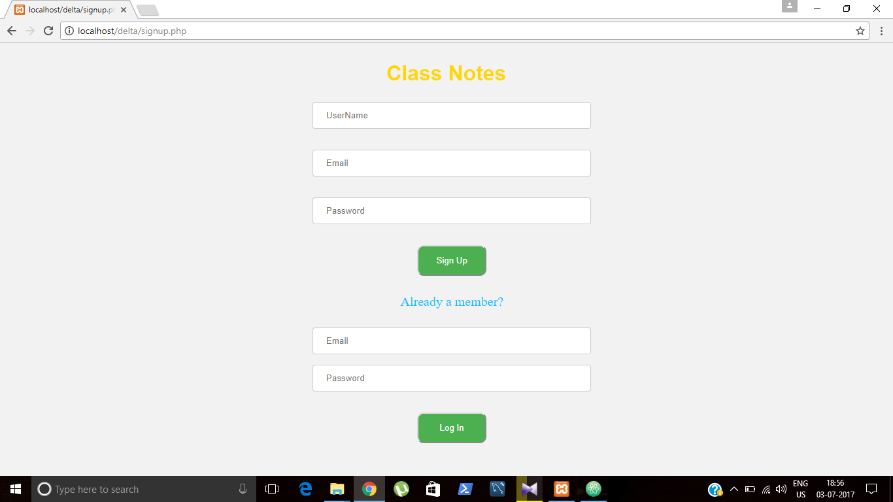
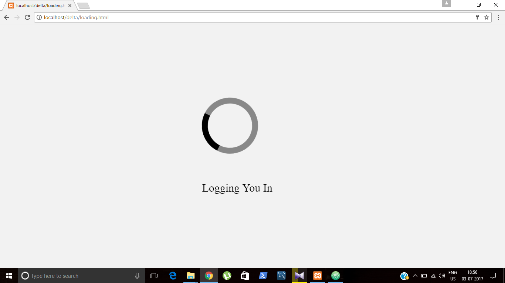
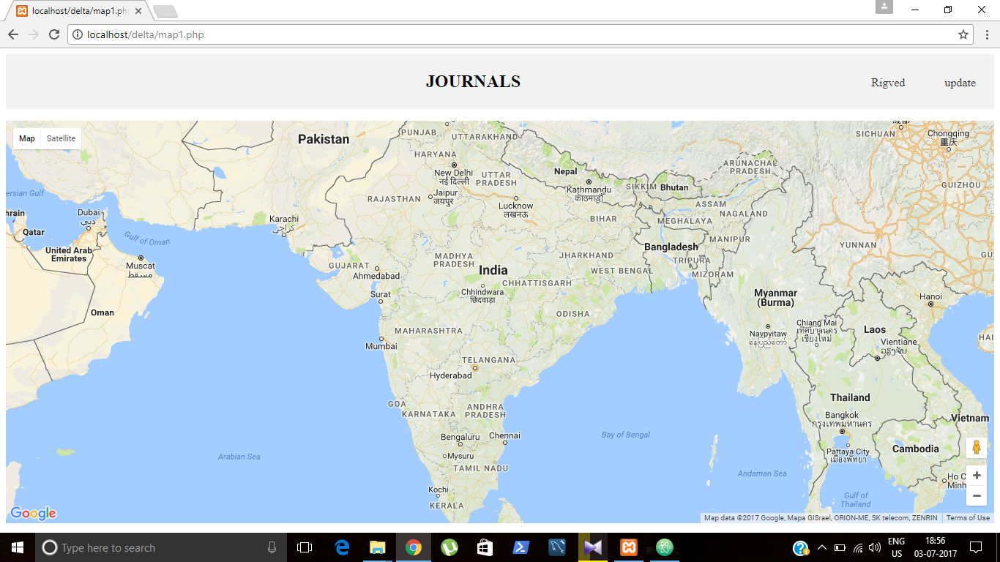
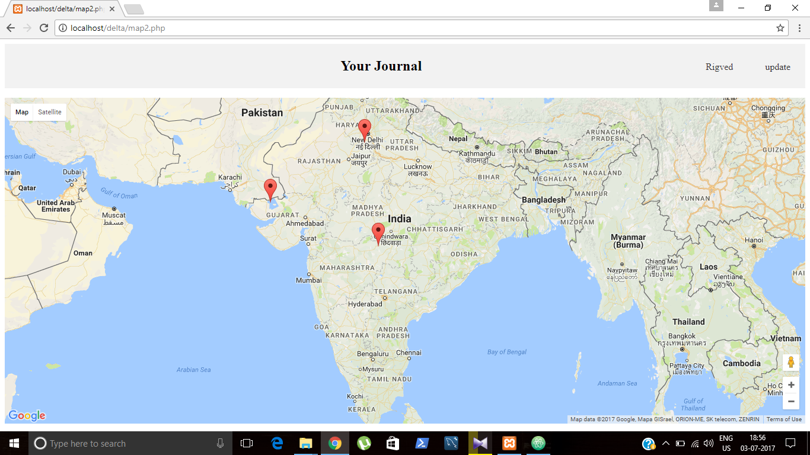
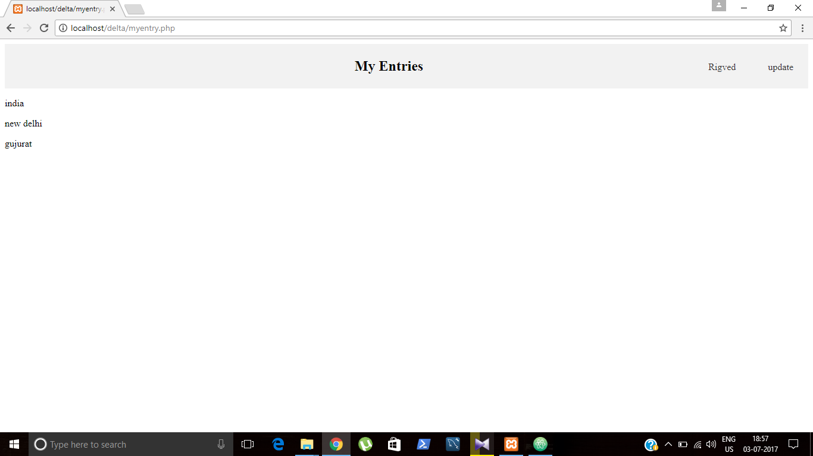
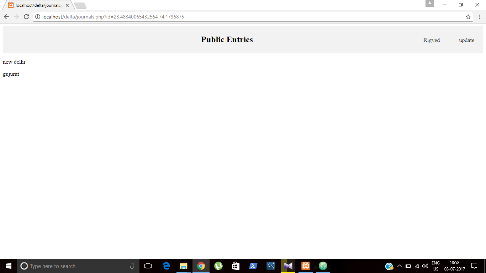
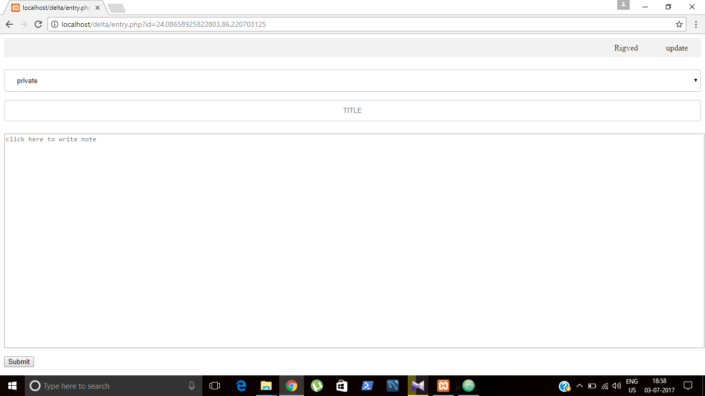

# spider-task3-backend
## server: XAMPP
## backend language used: PHP
## query language : MySQL
database:spider1.
tables used: signup and journal.
signup table used to store details of clients.
journal tables used to store latitiude,longitude,privacy and journal entry.

 ### [mysql](https://dev.mysql.com/downloads/workbench/).
 ### [XAMPP](https://www.apachefriends.org/download.html).
 ### [GOOGLE MAP API](https://developers.google.com/maps/documentation/javascript).
signup.php is the signup and login page to which you are rerouted if you are not logged in.
login.php checks if your email and password match the ones in database.
map1.php is the homepage which shows a google map which on clicking shows relevent journal entries regarding the place.
journal.php and show.php accompanies map.php
map2.php allows you to enter journal entry by clicking on a place in google map.
entry.php is where journal entry is made.
myentry.php shows your journals regardless of privacy.
2.php creates the database.
3.php creates the required tables.

### LOGIN PAGE:
 

 
### JOURNAL:
 
### YOUR JOURNAL: 

### YOUR ENTRIES:

### PUBLIC ENTRIES:

### WRITING ENTRIES:

## Before running .php files , first start apache in XAMPP control panel.
## Also enter your username and password of MySQL in all the .php files[signup.php,login.php,map1.php,map2.php,check.php,2.php,3.php etc..]
## enter your google map API key in script src of map1.php and map2.php.
